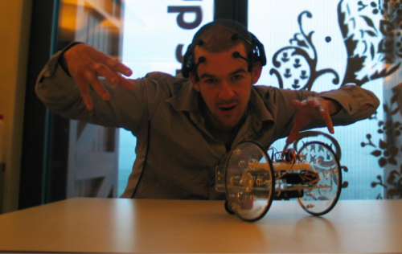

### Using the [Emotiv Epoc](https://emotiv.com/epoc.php) as a Robot-Controlling Device



> [VIDEO OF THE END RESULT](http://www.youtube.com/watch?v=4XhDWiaEUCc)

#### Introduction

During my internship at [Fablab Amsterdam](http://fablab.waag.org/), I came across a device that fascinated me a lot. It  was a freaky looking headset called the [Emotiv Epoc](https://emotiv.com/epoc.php) that promised to be able to read one's mind using [EEG measurements](https://www.wikiwand.com/en/Electroencephalography). When you wear it, it can separate 16 different thoughts, all based on a direction or a movement (for example: left, rotate forward, push, etc.). In this document I will describe the process I went through connecting the EPOC to a wireless controllable robot. By connecting two actions (push and pull) to two directions of the robot (relatively forward and backward) through Flash, I am able to control with my mind. It is an example of one of the many applications that one can think of when using such a revolutionary device. 


#### Installing the Emotiv EPOC

##### Installing the software 
The EPOC comes with a USB stick that it connects to wirelessly, and with a software package that contains three programs that I will describe briefly. 

###### Control Panel


The main program to view all the information the EPOC has to offer. The control panel has been divided into three categories: Expressiv Suite (facial expression), Affectiv Suite (subjective emotional responses) and the Cognitive Suite (intentional thoughts). I will only use the Cognitiv Suite to control the robot, although the other two are very interesting too. For example, one can also think of a way to control the robot through facial expression, instead of thoughts. 

###### EmoKey


This program links the different states one’s brain is in to the pressing of keys on the keyboard. The user is able to add a rule (top part of the image), and apply different conditions to this rule (bottom part). The conditions are related to the state of the brain.  
 
###### EmoComposer
This is a program to simulate the behaviour of the EPOC, but it lies beyond the scope of this document to explain it and it will not be used. I can be used when developing without the EPOC actually present, or to simulate a thought without actually having to think it. 
 
Note: for a more elaborate explanation on the different programs and their functionality, I would like to refer to the Emotive EPOC User Manual. It can be found in the “doc” folder of EPOC’s main folder. 
 
##### Putting the EPOC on your head 
According to the user manual, the EPOC should be placed on the head as follows:


First, I tried out the EPOC on myself, and this worked well. It connected easily and all the sensors where giving a green signal on the Control Panel, which means they make a good connection. But because of my hair, or actually, the lack of hair, I decided to try it on someone with a little more as well. They had much more trouble getting the device to work well. The problem is that the sensors have to be wet to work (for conduction), but when you have longer hair, it isn’t very wet. So you need a lot of liquid to keep the hair wet. 

##### Using the software
###### Teach cognitive actions 
The first thing I needed to do was to train the software. I wanted to train it to recognize two actions (push and pull), so that I could move the robot relatively forward and backward. This might sound a little boring, but according to the documentation it takes a trained mind to separate the different actions.
 
The training works very easily: 
• Start up the Control Panel and go to the Expressive Suite; 
• Train the neutral state, this defines the state of your brain when is it at rest; 
• Train the push and pull states.
Constant thoughts work best, and I have found out that a gesture also helps to relate to this thought. For example, I always frown a little and move my left hand up when pushing, while I move my eyelashes and my right hand up when thinking of pulling; 
 
The more times you try the training, the more specific the training gets. I always train every state five times. What I have also noted is that these trainings might vary every day. So a training that works fine on Monday might be totally useless on Thursday. 
 
Please note that these remarks are just speculations. As said, I am currently doing a more detailed user test that should give a better view at the learning abilities of the software.

###### Use EmoKey to trigger keys 
For example, when the user wants the following rule implemented into the EmoKey: “when I think of push, the key ‘w’ should be pressed”, the condition would look like this: 
rule 
name:  forward 
key(s):  “w” 
send once: yes 
 
condition 
action:  push 
trigger:  is greater than 
value:  50% 
 
which actually means: if my “think-value” of push is greater than 50%, press the button “w”.

##### Setting up the robot
###### Build the serb robot 
Instructions how to build the Serb robot are freely available at the [instructables website](http://www.instructables.com/id/How-to-Make-an-Arduino-Controlled-Servo-Robot-SER/)
 
It also includes links to where to download the material.

###### Equip it with an infrared module 
Another person that also did his internship at Fablab Amsterdam (Roald Joosten) has built the serb robot and equipped it with a infrared add-on for Arduino. This makes the robot able to act as a webserver and listen for input. For example, when the robot is on and one goes to the website: http://<SERVER_ADDRESS>/movement=x, the robot will move in direction x:

```
 Value of X	   direction to move in
 0	           stop
 1	           left
 2	           forward
 3	           right
 4	           backward
 ```
 
```<SERVER_ADDRESS>``` stands for the IP-address that the robot has received from the network. In my case, it is always the same. 

##### Connecting the pieces
###### Explanation 
Now that you have your serb robot working and the software responding correctly to your thoughts, it is time to connect them! I did this with a small flash program, but I am sure it can be done in a lot of different ways. 
 
I wrote a short piece of Actionscript (the programming language that Flash uses) that listens for a key press, and then responds by going to a website in a small frame on the website. So you write the piece of actionscript (EPOCtoSerb.fla), compile the file (EPOCtoSerb.swf) and run this file from the HTML document that compiles with the Flash file (EPOCtoSerb.html). This HTML document should be in the same directory as your SWF file. If the HML document is not being created automatically, you have to change the compile setting of Flash to make sure it also creates a HTML document. Now all you have to do is add a small frame to the HTML file. This is because every time your press a key, flash wants to open a website to give the robot instruction. But default, this causes the Flash program to stop, because it is not active anymore. Therefore it opens in a iFrame, keeping the SWF file active.

###### EmoKey setup 


```
If “push” > 50%  press “w” 
If “pull”  > 50%  press “s” 
If “push” < 50% AND 
 “pull” < 50%”  press “q” 
```
 
###### Flash code
```
 Key pressed	 target URL
 "w"	         http://<SERVER_ADDR>/movement=2
 "s"	         http://<SERVER_ADDR>/movement=4
 "q"           http://<SERVER_ADDR>/movement=0
```

###### EPOCtoSerb.fla
```
stage.addEventListener(KeyboardEvent.KEY_DOWN, key_down); 

function key_down(e:KeyboardEvent):void { 
  trace(e.keyCode); 
  dir.text = ""; 
  var num:int = 666; 
  switch (e.keyCode) { 
    case 83: 
      dir.text = "forward"; 
      num = 2; 
      break; 
    case 87: 
      dir.text = "backward"; 
      num = 4; 
      break; 
    case 65: 
      dir.text = "left"; 
      num = 1; 
      break; 
    case 68: 
     dir.text = "right"; 
     num = 3; 
     break; 
    case 81: 
     dir.text = "stop"; 
     num = 0; 
     break; 
  }
 
  if (dir.text != "") { 
    navigateToURL( 
    new URLRequest("http://10.0.135.185/movement=" + num), "serb"); 
  } 
}
```

When you create a new Flash-file to add this code, also add a textbox to the stage. Make it dynamic and give it the instance name: "dir". This will be the place where the current direction will be displayed. 
 
###### HTML code 
Just add the following line to your ```EPOCtoSerb.html``` somewhere in between the ```<body>``` tags: 

####### EPOCtoSerb.html

```
...
<body> 
...
<iframe name="serb"></iframe> 
...
</body> 
```

###### Control your robot 
Now start all the programs (Control Panel, EmoKey and EPOCtoSerb.html), make sure to enable the keystrokes on the EmoKey, concentrate, and you’re ready to go. Get that thing moving baby!

[I did, you can see it here!](http://www.youtube.com/watch?v=4XhDWiaEUCc)

If you have any question/comments please feel free to contact me.
